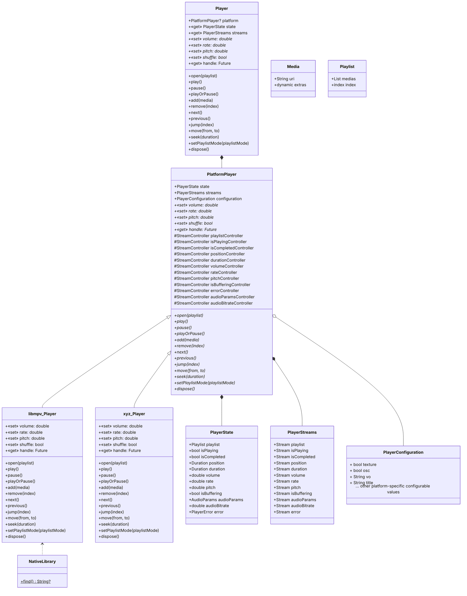

# [package:media_kit](https://github.com/alexmercerind/media_kit)

A complete video & audio library for Flutter & Dart.

<hr>

<strong>Sponsored with 💖 by</strong>
<br>
<a href="https://getstream.io/chat/sdk/flutter/?utm_source=alexmercerind_dart&utm_medium=Github_Repo_Content_Ad&utm_content=Developer&utm_campaign=alexmercerind_December2022_FlutterSDK_klmh22" target="_blank">
<picture>
<source media="(prefers-color-scheme: dark)" srcset="https://user-images.githubusercontent.com/28951144/204903234-4a64b63c-2fc2-4eef-be44-d287d27021e5.svg">
<source media="(prefers-color-scheme: light)" srcset="https://user-images.githubusercontent.com/28951144/204903022-bbaa49ca-74c2-4a8f-a05d-af8314bfd2cc.svg">

</picture>
</a>
<br>

  <h5>
    Rapidly ship in-app messaging with Stream's highly reliable chat infrastructure and feature-rich SDKs, including Flutter!
  </h5>
<h4>
  <a href="https://getstream.io/chat/sdk/flutter/?utm_source=alexmercerind_dart&utm_medium=Github_Repo_Content_Ad&utm_content=Developer&utm_campaign=alexmercerind_December2022_FlutterSDK_klmh22" target="_blank">
  Try the Flutter Chat tutorial
  </a>
</h4>

<hr>

https://user-images.githubusercontent.com/28951144/208764805-ff649766-26cb-43a7-b4bc-319cb541760b.mp4

## Installation

Add in your `pubspec.yaml`:

```yaml
dependencies:
  media_kit: ^0.0.1
  # For video support.
  media_kit_core_video: ^0.0.1
```

## Platforms

- [x] Windows
- [ ] Linux
- [ ] macOS
- [ ] Android
- [ ] iOS

## Docs

### Brief Start

Basic example.

```dart
import 'package:media_kit/media_kit.dart';

/// Create a new [Player] instance.
final player = Player();

...
/// Open some [Media] for playback.
await player.open(
  Playlist(
    [
      Media('file:///C:/Users/Hitesh/Music/Sample.MP3'),
      Media('file:///C:/Users/Hitesh/Video/Sample.MKV'),
      Media('https://www.example.com/sample.mp4'),
      Media('rtsp://www.example.com/live'),
    ],
  ),
);

...
/// Modify speed, pitch, volume or shuffle state.
player.rate = 1.0;
player.pitch = 1.2;
player.volume = 50.0;
player.shuffle = false;

...
/// Play / Pause
player.play();
player.pause();
player.playOrPause();

...
/// Release allocated resources back to the system.
player.dispose();

...
/// Subscribe to events.
player.streams.playlist.listen((event) {
  /// Trigger UI updates etc.
  print(event);
});
player.streams.playlist.listen((event) {
  /// Trigger UI updates etc.
  print(event);
});
player.streams.position.listen((event) {
  /// Trigger UI updates etc.
  print(event);
});
player.streams.duration.listen((event) {
  /// Trigger UI updates etc.
  print(event);
});
player.streams.audioBitrate.listen((event) {
  /// Trigger UI updates etc.
  if (event != null) {
    print('${event ~/ 1000} KB/s');
  }
});
```

### Rendering Video

Performant & H/W accelerated, automatically fallbacks to S/W rendering if system does not support it.

```dart
class MyScreenState extends State<MyScreen> {
  // Create a [Player] instance from `package:media_kit`.
  final Player player = Player();
  // Reference to the [VideoController] instance from `package:media_kit_core_video`.
  VideoController? controller;

  @override
  void initState() {
    super.initState();
    WidgetsBinding.instance.addPostFrameCallback((_) async {
      // Create a [VideoController] instance from `package:media_kit_core_video`.
      // Pass the [handle] of the [Player] from `package:media_kit` to the [VideoController] constructor.
      controller = await VideoController.create(player.handle);
      setState(() {});
    });
  }

  @override
  Widget build(BuildContext context) {
    return Video(
      /// Pass the [controller] to display the video output.
      controller: controller,
    );
  }
}
```

### Detailed Guide

_TODO: documentation_

Try out [the test application](https://github.com/harmonoid/media_kit/blob/master/media_kit_test/lib/main.dart) for more API usage examples.

## Goals

The primary goal of [package:media_kit](https://github.com/alexmercerind/media_kit) is to become a **strong, stable, feature-proof & modular** media playback library for Flutter. The idea is to support both **audio & video playback**.

[package:media_kit](https://github.com/alexmercerind/media_kit) makes rendering [**hardware accelerated video playback**](https://github.com/alexmercerind/dart_vlc/issues/345) possible in Flutter.

Since, targetting multiple features at once & bundling redundant native libraries can result in increased bundle size of the application, you can manually select the native libraries you want to bundle, depending upon your use-case. Currently, the scope of work is limited to Windows & Linux. The code is architectured to support multiple platforms & features. Support for more platforms will be added in future.

## Support

If you find [package:media_kit](https://github.com/alexmercerind/media_kit) package(s) useful or want to support future development, please consider supporting me. It's a very tedious process to write code, document, maintain & provide support for free. Since this is first of a kind project, it takes a lot of time to experiment & develop.

<a href='https://github.com/sponsors/alexmercerind'></a>

- [GitHub Sponsors](https://github.com/sponsors/alexmercerind)
- [PayPal](https://paypal.me/alexmercerind)

Thanks!

## Architecture

### package:media_kit

_Click on the zoom button on top-right or pinch inside._



### package:media_kit_core_video

_Click on the zoom button on top-right or pinch inside._

_TODO: documentation_

## Implementation

### package:media_kit

_TODO: documentation_

### package:media_kit_core_video

#### Windows

[libmpv](https://github.com/mpv-player/mpv/tree/master/libmpv) from [mpv Media Player](https://mpv.io/) is used for leveraging video playback.

- [libmpv](https://github.com/mpv-player/mpv/tree/master/libmpv) gives access to C API for rendering hardware-accelerated video output using OpenGL. See: [render.h](https://github.com/mpv-player/mpv/blob/master/libmpv/render.h) & [render_gl.h](https://github.com/mpv-player/mpv/blob/master/libmpv/render_gl.h).
- Flutter recently added ability for Windows to [render Direct3D `ID3D11Texture2D` textures](https://github.com/flutter/engine/pull/26840).

The two APIs above are hardware accelerated i.e. GPU backed buffers are used. **This is performant approach, easily capable for rendering 4K 60 FPS videos**, rest depends on the hardware. Since [libmpv](https://github.com/mpv-player/mpv/tree/master/libmpv) API is OpenGL based & the Texture API in Flutter is Direct3D based, [ANGLE (Almost Native Graphics Layer Engine)](https://github.com/google/angle) is used for interop, which automatically translates the OpenGL ES calls into Direct3D.

This hardware accelerated video output requires DirectX 11 or higher. Most Windows systems with either integrated or discrete GPUs should support this already. On systems where Direct3D fails to load due to missing graphics drivers or unsupported feature-level or DirectX version etc. a fallback pixel-buffer based software renderer is used. This means that video is rendered by CPU & every frame is copied back to the RAM. This will cause some redundant load on the CPU, result in decreased battery life & may not play higher resolution videos properly. However, it works.

You can visit my [experimentation repository](https://github.com/alexmercerind/flutter-windows-ANGLE-OpenGL-Direct3D-Interop) to see a minimal example showing OpenGL ES rendering inside Flutter Windows.

#### Linux

[libmpv](https://github.com/mpv-player/mpv/tree/master/libmpv) from [mpv Media Player](https://mpv.io/) is used for leveraging video playback. System shared libraries from distribution specific user-installed packages are used by-default. On Ubuntu / Debian based systems, you can install these using:

**NOTE:** This package also bundles specific shared libraries & dependencies.

```bash
sudo apt install mpv libmpv-dev
```

On Flutter Linux, [both OpenGL (hardware accelerated) & Pixel Buffer (software) APIs](https://github.com/flutter/engine/pull/24916) are available for rendering on Texture widget.

## Outcomes

_4K video playback on entry-level AMD Ryzen 3 2200U processor with Raden Vega 3 Mobile Graphics._

https://user-images.githubusercontent.com/28951144/208765832-416313c9-97d4-44d0-a902-e577f3c4f3f6.mp4

## License

Copyright © 2022, Hitesh Kumar Saini <<saini123hitesh@gmail.com>>

This project & the work under this repository is governed by MIT license that can be found in the [LICENSE](./LICENSE) file.
