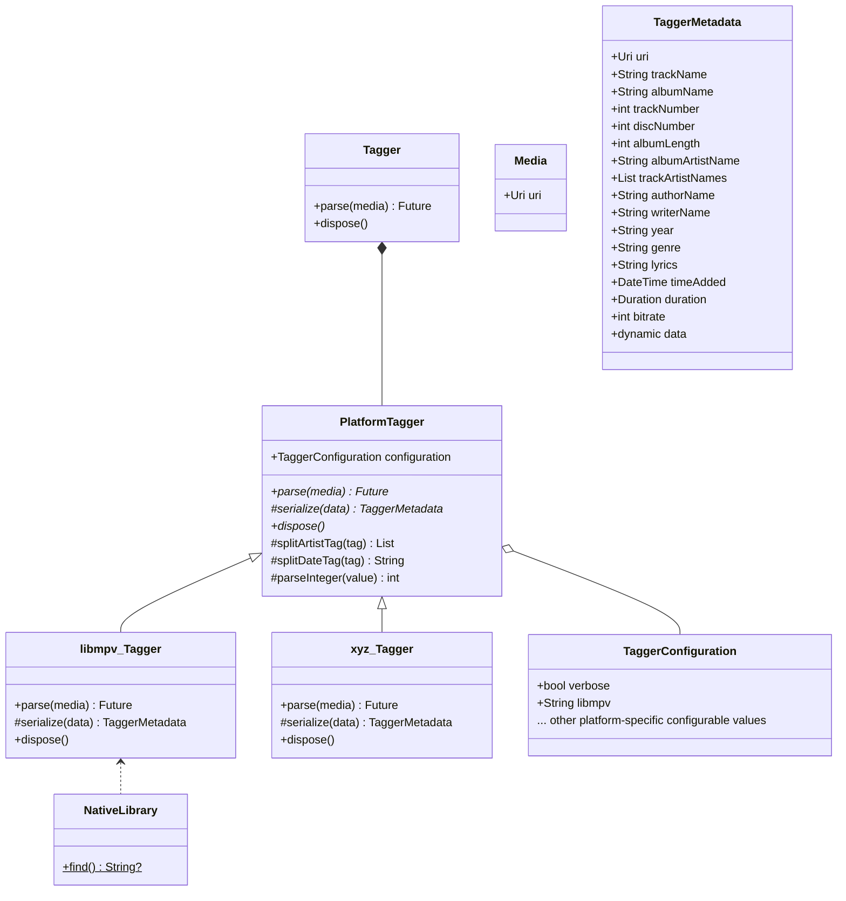

# [package:media_kit](https://github.com/alexmercerind/media_kit)

A complete video & audio library for Flutter.

## Goals

The primary goal of [package:media_kit](https://github.com/alexmercerind/media_kit) is to become a strong, stable, feature-proof & modular media playback library for Flutter. The idea is to support both audio & video playback. Besides media playback, a tag-reader is also implemented.

[package:media_kit](https://github.com/alexmercerind/media_kit) makes rendering [hardware accelerated video playback](https://github.com/alexmercerind/dart_vlc/issues/345) possible in Flutter.

Since, targetting multiple features at once & bundling redundant native libraries can result in increased bundle size of the application, you can manually select the native libraries you want to bundle, depending upon your use-case. Currently, the scope of work is limited to Windows & Linux. The code is architectured to support multiple platforms & features. Support for more platforms will be added in future.

## Architecture

Few attributes or details may me not present.

