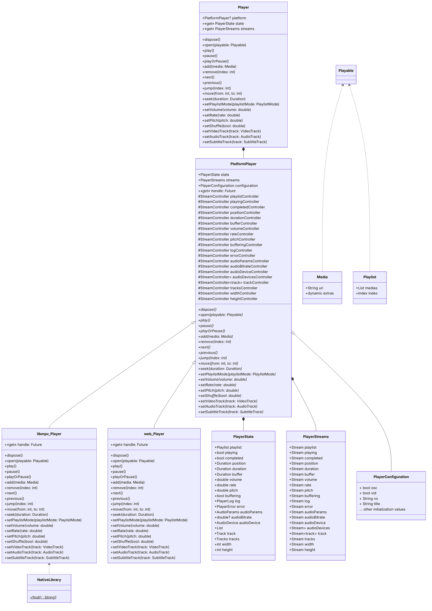
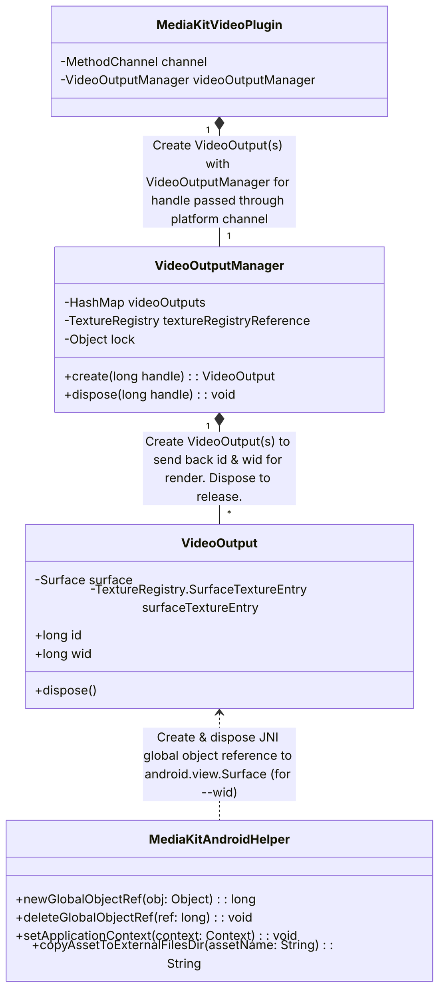
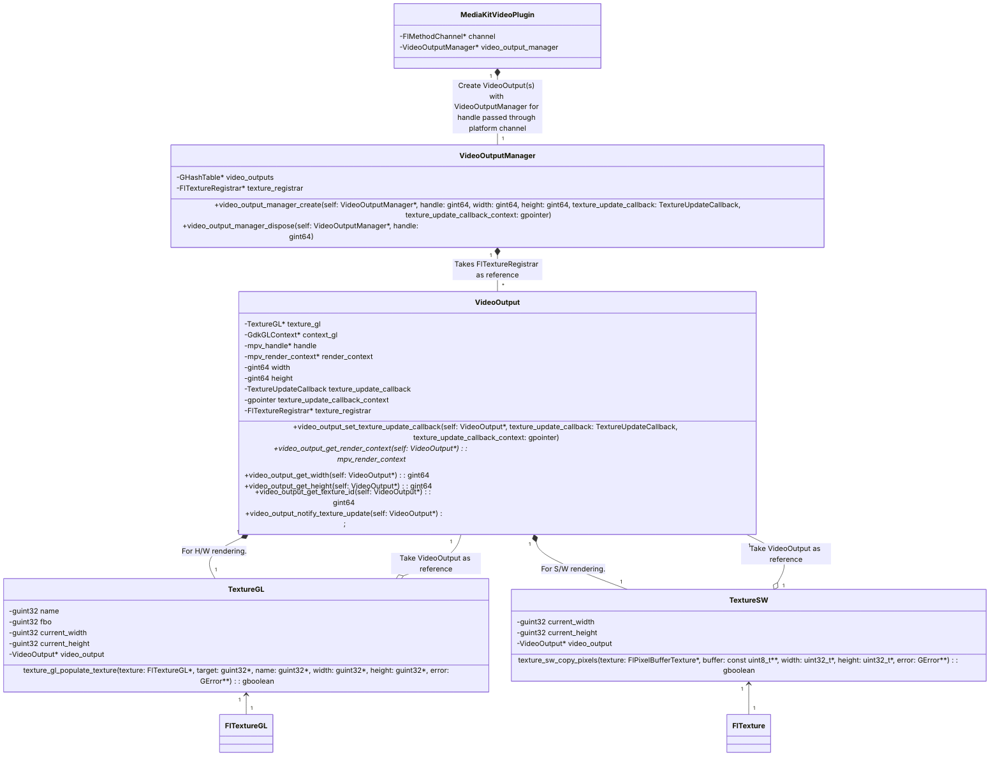

```mermaid
%%{
  init: {
    'themeVariables': {
      'fontFamily': 'BlinkMacSystemFont, Segoe UI, Noto Sans, Helvetica, Arial, Apple Color Emoji, Segoe UI Emoji'
    }
  }
}%%
classDiagram

  MediaKitVideoPlugin "1" *-- "1" VideoOutputManager: Create VideoOutput(s) with VideoOutputManager for handle passed through platform channel
  VideoOutputManager "1" *-- "*" VideoOutput: Takes PluginRegistrarWindows as reference
  VideoOutputManager "1" *-- "1" ThreadPool
  VideoOutput "*" o-- "1" ThreadPool: Post creation, resize & render etc. tasks involving EGL to ensure synchronous EGL/ANGLE usage across multiple VideoOutput(s)
  VideoOutput "1" *-- "1" ANGLESurfaceManager: Only for H/W accelerated rendering

  class MediaKitVideoPlugin {
    -flutter::PluginRegistrarWindows registrar_
    -std::unique_ptr<MethodChannel> channel_
    -std::unique_ptr<VideoOutputManager> video_output_manager_
    -HandleMethodCall(method_call, result);
  }

  class ThreadPool {
    +Post(function: std::function)
  }

  class VideoOutputManager {
    +Create(handle: int, width: optional<int>, height: optional<int>, texture_update_callback: std::function)
    +Dispose(handle: int)

    -std::mutex mutex_
    -std::unique_ptr<ThreadPool> thread_pool_
    -flutter::PluginRegistrarWindows registrar_
    -std::unordered_map<int64_t, std::unique_ptr<VideoOutput>> video_outputs_
  }

  class VideoOutput {
    +«get» texture_id: int64_t
    +«get» width: int64_t
    +«get» height: int64_t
    -mpv_handle* handle_
    -mpv_render_context* render_context_
    -std::optional<int64_t> width_
    -std::optional<int64_t> height_
    -bool enable_hardware_acceleration_
    -int64_t texture_id_
    -flutter::PluginRegistrarWindows registrar_
    -ThreadPool* thread_pool_ref_
    -bool destroyed_
    -std::mutex textures_mutex_
    -std::unordered_map<int64_t, std::unique_ptr<flutter::TextureVariant>> texture_variants_
    -std::unique_ptr<ANGLESurfaceManager> surface_manager_ HW
    -std::unordered_map<int64_t, std::unique_ptr<FlutterDesktopGpuSurfaceDescriptor>> textures_ HW
    -std::unique_ptr<uint8_t[]> pixel_buffer_ SW
    -std::unordered_map<int64_t, std::unique_ptr<FlutterDesktopPixelBuffer>> pixel_buffer_textures_ SW
    -std::function texture_update_callback_

    +SetTextureUpdateCallback(callback: std::function<void(int64_t, int64_t, int64_t)>)
    +SetSize(width: std::optional<int64_t>, height: std::optional<int64_t>)
    -NotifyRender()
    -Render()
    -CheckAndResize()
    -Resize(required_width: int64_t, required_height: int64_t)
    -GetVideoWidth(): int64_t
    -GetVideoHeight(): int64_t
  }

  class ANGLESurfaceManager {
    +«get» width: int32_t
    +«get» height: int32_t
    +«get» handle: HANDLE

    +HandleResize(width: int32_t, height: int32_t)
    +Draw(draw_callback: std::function<void()>)
    +Read()
    +SwapBuffers()
    +MakeCurrent(value: bool)
    -CreateEGLDisplay()
    -Initialize()
    -InitializeD3D11()
    -InitializeD3D9()
    -CleanUp(release_context: bool)
    -CreateEGLDisplay()
    -ShowFailureMessage(message: wchar_t[])

    -IDXGIAdapter* adapter_
    -int32_t width_
    -int32_t height_
    -ID3D11Device* d3d_11_device_
    -ID3D11DeviceContext* d3d_11_device_context_
    -Microsoft::WRL::ComPtr<ID3D11Texture2D>
    -Microsoft::WRL::ComPtr<IDXGISwapChain>
    -IDirect3D9Ex* d3d_9_ex_
    -IDirect3DDevice9Ex* d3d_9_device_ex_
    -IDirect3DTexture9* d3d_9_texture_
    -HANDLE handle_
    -EGLSurface surface_
    -EGLDisplay display_
    -EGLContext context_
    -EGLConfig config_
  }
```

# [package:media_kit](https://github.com/alexmercerind/media_kit)

A complete video & audio playback library for Flutter & Dart. Performant, stable, feature-proof & modular.

[](https://discord.gg/h7qf2R9n57) [](https://github.com/alexmercerind/media_kit/actions/workflows/ci.yml)

<hr>

<strong>Sponsored with 💖 by</strong>

<a href="https://getstream.io/chat/sdk/flutter/?utm_source=alexmercerind_dart&utm_medium=Github_Repo_Content_Ad&utm_content=Developer&utm_campaign=alexmercerind_December2022_FlutterSDK_klmh22" target="_blank">
  <picture>
    <source media="(prefers-color-scheme: dark)" srcset="https://user-images.githubusercontent.com/28951144/204903234-4a64b63c-2fc2-4eef-be44-d287d27021e5.svg">
    <source media="(prefers-color-scheme: light)" srcset="https://user-images.githubusercontent.com/28951144/204903022-bbaa49ca-74c2-4a8f-a05d-af8314bfd2cc.svg">
    
  </picture>
</a>
<br></br>
<strong>
  <a href="https://getstream.io/chat/sdk/flutter/?utm_source=alexmercerind_dart&utm_medium=Github_Repo_Content_Ad&utm_content=Developer&utm_campaign=alexmercerind_December2022_FlutterSDK_klmh22" target="_blank">
  Try the Flutter Chat tutorial
  </a>
</strong>

<br></br>

<a href="https://ottomatic.io/" target="_blank">
  <picture>
    <source media="(prefers-color-scheme: dark)" srcset="https://user-images.githubusercontent.com/28951144/228648854-e5d7c557-ee92-47b2-a037-17b447873e1c.svg">
    <source media="(prefers-color-scheme: light)" srcset="https://user-images.githubusercontent.com/28951144/228648844-f2a59ab1-12cd-4fee-bc8d-b2d332033c45.svg">
    
  </picture>
</a>
<br></br>
<strong>
  <a href="https://ottomatic.io/" target="_blank">
  Clever Apps for Film Professionals
  </a>
</strong>

## Installation

[package:media_kit](https://github.com/alexmercerind/media_kit) is split into number of packages to improve modularity & reduce bundle size.

#### For apps that need video playback:

```yaml
dependencies:
  media_kit: ^0.0.11                             # Primary package.
  
  media_kit_video: ^0.0.12                       # For video rendering.
  
  media_kit_native_event_loop: ^1.0.4            # Support for higher number of concurrent instances & better performance.
  
  media_kit_libs_android_video: ^1.0.6           # Android package for video native libraries.
  media_kit_libs_ios_video: ^1.0.4               # iOS package for video native libraries.
  media_kit_libs_macos_video: ^1.0.5             # macOS package for video native libraries.
  media_kit_libs_windows_video: ^1.0.2           # Windows package for video native libraries.
  media_kit_libs_linux: ^1.0.2                   # GNU/Linux dependency package.
```

#### For apps that need audio playback:

```yaml
dependencies:
  media_kit: ^0.0.11                             # Primary package.
  
  media_kit_native_event_loop: ^1.0.4            # Support for higher number of concurrent instances & better performance.
  
  media_kit_libs_android_audio: ^1.0.6           # Android package for audio native libraries.
  media_kit_libs_ios_audio: ^1.0.4               # iOS package for audio native libraries.
  media_kit_libs_macos_audio: ^1.0.5             # macOS package for audio native libraries.
  media_kit_libs_windows_audio: ^1.0.3           # Windows package for audio native libraries.
  media_kit_libs_linux: ^1.0.2                   # GNU/Linux dependency package.
```

**Notes:**

- If app needs both video & audio playback, select video playback libraries.
- [Enable --split-per-abi](https://docs.flutter.dev/deployment/android#what-is-a-fat-apk) or [use app bundle (instead of APK)](https://docs.flutter.dev/deployment/android#when-should-i-build-app-bundles-versus-apks) on Android.
- media_kit_libs_*** packages may be omitted depending upon the platform your app targets.

## Platforms

| Platform | Video | Audio | Notes | Demo |
| -------- | ----- | ----- | ----- | ---- |
| Android     | ✅    | ✅    | Android 5.0 or above.                | [Download](https://github.com/alexmercerind/media_kit/releases/download/media_kit-v0.0.11/media_kit_test_android-arm64-v8a.apk) |
| iOS         | ✅    | ✅    | iOS 13 or above.                     | [Download](https://github.com/alexmercerind/media_kit/releases/download/media_kit-v0.0.11/media_kit_test_ios_arm64.7z)          |
| macOS       | ✅    | ✅    | macOS 10.9 or above.                 | [Download](https://github.com/alexmercerind/media_kit/releases/download/media_kit-v0.0.11/media_kit_test_macos_universal.7z)    |
| Windows     | ✅    | ✅    | Windows 7 or above.                  | [Download](https://github.com/alexmercerind/media_kit/releases/download/media_kit-v0.0.11/media_kit_test_win32_x64.7z)          |
| GNU/Linux   | ✅    | ✅    | Any modern GNU/Linux distribution.   | [Download](https://github.com/alexmercerind/media_kit/releases/download/media_kit-v0.0.11/media_kit_test_linux_x64.7z)          |
| Web         | 🚧    | 🚧    | [WIP](https://github.com/alexmercerind/media_kit/pull/128)                                 | [WIP](https://github.com/alexmercerind/media_kit/pull/128)               |

<table>
  <tr>
    <td>
      Android
    </td>
    <td>
      iOS
    </td>
  </tr>
  <tr>
    <td>
      </img>
    </td>
    <td>
      </img>
    </td>
</table>

<table>
  <tr>
    <td>
      macOS
    </td>
    <td>
      Windows
    </td>
    <td>
      GNU/Linux
    </td>
  </tr>
  <tr>
    <td>
      </img>
    </td>
    <td>
      </img>
    </td>
    <td>
      </img>
    </td>
</table>

## Guide

### TL;DR

A quick usage example:

```dart
import 'package:flutter/material.dart';

import 'package:media_kit/media_kit.dart';                      // Provides [Player], [Media], [Playlist] etc.
import 'package:media_kit_video/media_kit_video.dart';          // Provides [VideoController] & [Video] etc.        

void main() {
  WidgetsFlutterBinding.ensureInitialized();
  // Necessary initialization for package:media_kit.
  MediaKit.ensureInitialized();
  runApp(
    const MaterialApp(
      home: MyScreen(),
    ),
  );
}

class MyScreen extends StatefulWidget {
  const MyScreen({Key? key}) : super(key: key);
  @override
  State<MyScreen> createState() => MyScreenState();
}

class MyScreenState extends State<MyScreen> {
  // Create a [Player] to control playback.
  late final player = Player();
  // Create a [VideoController] to handle video output from [Player].
  late final controller = VideoController(player);

  @override
  void initState() {
    super.initState();
    // Play a [Media] or [Playlist].
    player.open(Media('https://user-images.githubusercontent.com/28951144/229373695-22f88f13-d18f-4288-9bf1-c3e078d83722.mp4'));
  }

  @override
  void dispose() {
    player.dispose();
    super.dispose();
  }

  @override
  Widget build(BuildContext context) {
    return Scaffold(
      // Use [Video] widget to display video output.
      body: Video(
        controller: controller,
      ),
    );
  }
}
```

~~For detailed overview & guide to number of features in the library, please visit the [documentation](#).~~ WIP

## Goals

[package:media_kit](https://github.com/alexmercerind/media_kit) is a library for Flutter & Dart which **provides video & audio playback**.

- **Strong:** Supports _most_ video & audio codecs.
- **Performant:**
  - Handles multiple FHD videos flawlessly.
  - Rendering is GPU powered (hardware accelerated).
  - 4K / 8K 60 FPS is supported.
- **Stable:** Implementation is well tested & used across number of intensive media playback related apps.
- **Feature Proof:** A simple usage API while offering large number of features to target multitude of apps.
- **Modular:** Project is split into number of packages for reducing bundle size.
- **Cross Platform**: Implementation works on all platforms supported by Flutter & Dart:
  - Android
  - iOS
  - macOS
  - Windows
  - GNU/Linux
  - ~~Web~~ WIP
- **Flexible Architecture:**
  - Major part of implementation (80%+) is in 100% Dart ([FFI](https://dart.dev/guides/libraries/c-interop)) & shared across platforms.
    - Makes behavior of library same & more predictable across platforms.
    - Makes development & implementation of new features easier & faster.
    - Avoids separate maintenance of native implementation for each platform.
  - Only video embedding code is platform specific & part of separate package.

You may see project's [architecture](https://github.com/alexmercerind/media_kit#architecture) & [implementation](https://github.com/alexmercerind/media_kit#implementation) details for further information.

The project aims to meet demands of the community, this includes:
1. Holding accountability.
2. Ensuring timely maintenance.

## Fund Development

If you find [package:media_kit](https://github.com/alexmercerind/media_kit) package(s) useful, please consider sponsoring me.

Since this is first of a kind project, it takes a lot of time to experiment & develop. It's a very tedious process to write code, document, maintain & provide support for free. Your support can ensure the quality of the package your project depends upon. I will feel rewarded for my hard-work & research.

- **[GitHub Sponsors](https://github.com/sponsors/alexmercerind)**
- **[PayPal](https://paypal.me/alexmercerind)**

<a href='https://github.com/sponsors/alexmercerind'></a>

Thanks!

## Supported Formats

A wide variety of formats & codecs are supported. Complete list may be found below:

<details>

```
3dostr          3DO STR
4xm             4X Technologies
aa              Audible AA format files
aac             raw ADTS AAC (Advanced Audio Coding)
aax             CRI AAX
ac3             raw AC-3
ace             tri-Ace Audio Container
acm             Interplay ACM
act             ACT Voice file format
adf             Artworx Data Format
adp             ADP
ads             Sony PS2 ADS
adx             CRI ADX
aea             MD STUDIO audio
afc             AFC
aiff            Audio IFF
aix             CRI AIX
alaw            PCM A-law
alias_pix       Alias/Wavefront PIX image
alp             LEGO Racers ALP
amr             3GPP AMR
amrnb           raw AMR-NB
amrwb           raw AMR-WB
anm             Deluxe Paint Animation
apac            raw APAC
apc             CRYO APC
ape             Monkey's Audio
apm             Ubisoft Rayman 2 APM
apng            Animated Portable Network Graphics
aptx            raw aptX
aptx_hd         raw aptX HD
aqtitle         AQTitle subtitles
argo_asf        Argonaut Games ASF
argo_brp        Argonaut Games BRP
argo_cvg        Argonaut Games CVG
asf             ASF (Advanced / Active Streaming Format)
asf_o           ASF (Advanced / Active Streaming Format)
ass             SSA (SubStation Alpha) subtitle
ast             AST (Audio Stream)
au              Sun AU
av1             AV1 Annex B
avi             AVI (Audio Video Interleaved)
avr             AVR (Audio Visual Research)
avs             Argonaut Games Creature Shock
avs2            raw AVS2-P2/IEEE1857.4
avs3            raw AVS3-P2/IEEE1857.10
bethsoftvid     Bethesda Softworks VID
bfi             Brute Force & Ignorance
bfstm           BFSTM (Binary Cafe Stream)
bin             Binary text
bink            Bink
binka           Bink Audio
bit             G.729 BIT file format
bitpacked       Bitpacked
bmp_pipe        piped bmp sequence
bmv             Discworld II BMV
boa             Black Ops Audio
bonk            raw Bonk
brender_pix     BRender PIX image
brstm           BRSTM (Binary Revolution Stream)
c93             Interplay C93
caf             Apple CAF (Core Audio Format)
cavsvideo       raw Chinese AVS (Audio Video Standard)
cdg             CD Graphics
cdxl            Commodore CDXL video
cine            Phantom Cine
codec2          codec2 .c2 demuxer
codec2raw       raw codec2 demuxer
concat          Virtual concatenation script
cri_pipe        piped cri sequence
dash            Dynamic Adaptive Streaming over HTTP
data            raw data
daud            D-Cinema audio
dcstr           Sega DC STR
dds_pipe        piped dds sequence
derf            Xilam DERF
dfa             Chronomaster DFA
dfpwm           raw DFPWM1a
dhav            Video DAV
dirac           raw Dirac
dnxhd           raw DNxHD (SMPTE VC-3)
dpx_pipe        piped dpx sequence
dsf             DSD Stream File (DSF)
dshow           DirectShow capture
dsicin          Delphine Software International CIN
dss             Digital Speech Standard (DSS)
dts             raw DTS
dtshd           raw DTS-HD
dv              DV (Digital Video)
dvbsub          raw dvbsub
dvbtxt          dvbtxt
dxa             DXA
ea              Electronic Arts Multimedia
ea_cdata        Electronic Arts cdata
eac3            raw E-AC-3
epaf            Ensoniq Paris Audio File
exr_pipe        piped exr sequence
f32be           PCM 32-bit floating-point big-endian
f32le           PCM 32-bit floating-point little-endian
f64be           PCM 64-bit floating-point big-endian
f64le           PCM 64-bit floating-point little-endian
ffmetadata      FFmpeg metadata in text
film_cpk        Sega FILM / CPK
filmstrip       Adobe Filmstrip
fits            Flexible Image Transport System
flac            raw FLAC
flic            FLI/FLC/FLX animation
flv             FLV (Flash Video)
frm             Megalux Frame
fsb             FMOD Sample Bank
fwse            Capcom's MT Framework sound
g722            raw G.722
g723_1          G.723.1
g726            raw big-endian G.726 ("left aligned")
g726le          raw little-endian G.726 ("right aligned")
g729            G.729 raw format demuxer
gdigrab         GDI API Windows frame grabber
gdv             Gremlin Digital Video
gem_pipe        piped gem sequence
genh            GENeric Header
gif             CompuServe Graphics Interchange Format (GIF)
gif_pipe        piped gif sequence
gsm             raw GSM
gxf             GXF (General eXchange Format)
h261            raw H.261
h263            raw H.263
h264            raw H.264 video
hca             CRI HCA
hcom            Macintosh HCOM
hdr_pipe        piped hdr sequence
hevc            raw HEVC video
hls             Apple HTTP Live Streaming
hnm             Cryo HNM v4
ico             Microsoft Windows ICO
idcin           id Cinematic
idf             iCE Draw File
iff             IFF (Interchange File Format)
ifv             IFV CCTV DVR
ilbc            iLBC storage
image2          image2 sequence
image2pipe      piped image2 sequence
imf             IMF (Interoperable Master Format)
ingenient       raw Ingenient MJPEG
ipmovie         Interplay MVE
ipu             raw IPU Video
ircam           Berkeley/IRCAM/CARL Sound Format
iss             Funcom ISS
iv8             IndigoVision 8000 video
ivf             On2 IVF
ivr             IVR (Internet Video Recording)
j2k_pipe        piped j2k sequence
jacosub         JACOsub subtitle format
jpeg_pipe       piped jpeg sequence
jpegls_pipe     piped jpegls sequence
jpegxl_pipe     piped jpegxl sequence
jv              Bitmap Brothers JV
kux             KUX (YouKu)
kvag            Simon & Schuster Interactive VAG
laf             LAF (Limitless Audio Format)
lavfi           Libavfilter virtual input device
live_flv        live RTMP FLV (Flash Video)
lmlm4           raw lmlm4
loas            LOAS AudioSyncStream
lrc             LRC lyrics
luodat          Video CCTV DAT
lvf             LVF
lxf             VR native stream (LXF)
m4v             raw MPEG-4 video
matroska,webm   Matroska / WebM
mca             MCA Audio Format
mcc             MacCaption
mgsts           Metal Gear Solid: The Twin Snakes
microdvd        MicroDVD subtitle format
mjpeg           raw MJPEG video
mjpeg_2000      raw MJPEG 2000 video
mlp             raw MLP
mlv             Magic Lantern Video (MLV)
mm              American Laser Games MM
mmf             Yamaha SMAF
mods            MobiClip MODS
moflex          MobiClip MOFLEX
mov,mp4,m4a,3gp,3g2,mj2 QuickTime / MOV
mp3             MP2/3 (MPEG audio layer 2/3)
mpc             Musepack
mpc8            Musepack SV8
mpeg            MPEG-PS (MPEG-2 Program Stream)
mpegts          MPEG-TS (MPEG-2 Transport Stream)
mpegtsraw       raw MPEG-TS (MPEG-2 Transport Stream)
mpegvideo       raw MPEG video
mpjpeg          MIME multipart JPEG
mpl2            MPL2 subtitles
mpsub           MPlayer subtitles
msf             Sony PS3 MSF
msnwctcp        MSN TCP Webcam stream
msp             Microsoft Paint (MSP))
mtaf            Konami PS2 MTAF
mtv             MTV
mulaw           PCM mu-law
musx            Eurocom MUSX
mv              Silicon Graphics Movie
mvi             Motion Pixels MVI
mxf             MXF (Material eXchange Format)
mxg             MxPEG clip
nc              NC camera feed
nistsphere      NIST SPeech HEader REsources
nsp             Computerized Speech Lab NSP
nsv             Nullsoft Streaming Video
nut             NUT
nuv             NuppelVideo
obu             AV1 low overhead OBU
ogg             Ogg
oma             Sony OpenMG audio
paf             Amazing Studio Packed Animation File
pam_pipe        piped pam sequence
pbm_pipe        piped pbm sequence
pcx_pipe        piped pcx sequence
pfm_pipe        piped pfm sequence
pgm_pipe        piped pgm sequence
pgmyuv_pipe     piped pgmyuv sequence
pgx_pipe        piped pgx sequence
phm_pipe        piped phm sequence
photocd_pipe    piped photocd sequence
pictor_pipe     piped pictor sequence
pjs             PJS (Phoenix Japanimation Society) subtitles
pmp             Playstation Portable PMP
png_pipe        piped png sequence
pp_bnk          Pro Pinball Series Soundbank
ppm_pipe        piped ppm sequence
psd_pipe        piped psd sequence
psxstr          Sony Playstation STR
pva             TechnoTrend PVA
pvf             PVF (Portable Voice Format)
qcp             QCP
qdraw_pipe      piped qdraw sequence
qoi_pipe        piped qoi sequence
r3d             REDCODE R3D
rawvideo        raw video
realtext        RealText subtitle format
redspark        RedSpark
rka             RKA (RK Audio)
rl2             RL2
rm              RealMedia
roq             id RoQ
rpl             RPL / ARMovie
rsd             GameCube RSD
rso             Lego Mindstorms RSO
rtp             RTP input
rtsp            RTSP input
s16be           PCM signed 16-bit big-endian
s16le           PCM signed 16-bit little-endian
s24be           PCM signed 24-bit big-endian
s24le           PCM signed 24-bit little-endian
s32be           PCM signed 32-bit big-endian
s32le           PCM signed 32-bit little-endian
s337m           SMPTE 337M
s8              PCM signed 8-bit
sami            SAMI subtitle format
sap             SAP input
sbc             raw SBC (low-complexity subband codec)
sbg             SBaGen binaural beats script
scc             Scenarist Closed Captions
scd             Square Enix SCD
sdns            Xbox SDNS
sdp             SDP
sdr2            SDR2
sds             MIDI Sample Dump Standard
sdx             Sample Dump eXchange
ser             SER (Simple uncompressed video format for astronomical capturing)
sga             Digital Pictures SGA
sgi_pipe        piped sgi sequence
shn             raw Shorten
siff            Beam Software SIFF
simbiosis_imx   Simbiosis Interactive IMX
sln             Asterisk raw pcm
smjpeg          Loki SDL MJPEG
smk             Smacker
smush           LucasArts Smush
sol             Sierra SOL
sox             SoX native
spdif           IEC 61937 (compressed data in S/PDIF)
srt             SubRip subtitle
stl             Spruce subtitle format
subviewer       SubViewer subtitle format
subviewer1      SubViewer v1 subtitle format
sunrast_pipe    piped sunrast sequence
sup             raw HDMV Presentation Graphic Stream subtitles
svag            Konami PS2 SVAG
svg_pipe        piped svg sequence
svs             Square SVS
swf             SWF (ShockWave Flash)
tak             raw TAK
tedcaptions     TED Talks captions
thp             THP
tiertexseq      Tiertex Limited SEQ
tiff_pipe       piped tiff sequence
tmv             8088flex TMV
truehd          raw TrueHD
tta             TTA (True Audio)
tty             Tele-typewriter
txd             Renderware TeXture Dictionary
ty              TiVo TY Stream
u16be           PCM unsigned 16-bit big-endian
u16le           PCM unsigned 16-bit little-endian
u24be           PCM unsigned 24-bit big-endian
u24le           PCM unsigned 24-bit little-endian
u32be           PCM unsigned 32-bit big-endian
u32le           PCM unsigned 32-bit little-endian
u8              PCM unsigned 8-bit
v210            Uncompressed 4:2:2 10-bit
v210x           Uncompressed 4:2:2 10-bit
vag             Sony PS2 VAG
vbn_pipe        piped vbn sequence
vc1             raw VC-1
vc1test         VC-1 test bitstream
vfwcap          VfW video capture
vidc            PCM Archimedes VIDC
vividas         Vividas VIV
vivo            Vivo
vmd             Sierra VMD
vobsub          VobSub subtitle format
voc             Creative Voice
vpk             Sony PS2 VPK
vplayer         VPlayer subtitles
vqf             Nippon Telegraph and Telephone Corporation (NTT) TwinVQ
w64             Sony Wave64
wady            Marble WADY
wav             WAV / WAVE (Waveform Audio)
wavarc          Waveform Archiver
wc3movie        Wing Commander III movie
webm_dash_manifest WebM DASH Manifest
webp_pipe       piped webp sequence
webvtt          WebVTT subtitle
wsaud           Westwood Studios audio
wsd             Wideband Single-bit Data (WSD)
wsvqa           Westwood Studios VQA
wtv             Windows Television (WTV)
wv              WavPack
wve             Psion 3 audio
xa              Maxis XA
xbin            eXtended BINary text (XBIN)
xbm_pipe        piped xbm sequence
xmd             Konami XMD
xmv             Microsoft XMV
xpm_pipe        piped xpm sequence
xvag            Sony PS3 XVAG
xwd_pipe        piped xwd sequence
xwma            Microsoft xWMA
yop             Psygnosis YOP
yuv4mpegpipe    YUV4MPEG pipe
```

</details>

**Notes:**

- The list contains the supported formats (& not containers).
  - A video/audio format may be present in a number of containers.
  - e.g. an MP4 file generally contains H264 video stream.

## Permissions

You may need to declare & request internet access or file-system permissions depending upon platform.

### Android

Edit `android/app/src/main/AndroidManifest.xml` to add the following permissions inside `<manifest>` tag:

```xml
<manifest xmlns:android="http://schemas.android.com/apk/res/android" package="com.example.app">
    <application
      ...
      />
    </application>
    <!--
      Internet access permissions.
      -->
    <uses-permission android:name="android.permission.INTERNET" />
    <!--
      Storage access permissions.
      Android 12 or lower.
      -->
    <uses-permission android:name="android.permission.READ_EXTERNAL_STORAGE" />
    <uses-permission android:name="android.permission.WRITE_EXTERNAL_STORAGE" />
    <!--
      Media access permissions.
      Android 13 or higher.
      https://developer.android.com/about/versions/13/behavior-changes-13#granular-media-permissions
      -->
    <uses-permission android:name="android.permission.READ_MEDIA_AUDIO" />
    <uses-permission android:name="android.permission.READ_MEDIA_VIDEO" />
</manifest>
```

Use [`package:permission_handler`](https://pub.dev/packages/permission_handler) to request access at runtime:

```dart
if (/* Android 13 or higher. */) {
  if (await Permission.storage.isDenied || await Permission.storage.isPermanentlyDenied) {
    final state = await Permission.storage.request();
    if (!state.isGranted) {
      await SystemNavigator.pop();
    }
  }
} else {
  if (await Permission.audio.isDenied || await Permission.audio.isPermanentlyDenied) {
    final state = await Permission.audio.request();
    if (!state.isGranted) {
      await SystemNavigator.pop();
    }
  }
  if (await Permission.videos.isDenied || await Permission.videos.isPermanentlyDenied) {
    final state = await Permission.videos.request();
    if (!state.isGranted) {
      await SystemNavigator.pop();
    }
  }
}
```

### iOS

Edit `ios/Runner/Info-Release.plist`, `ios/Runner/Info-Profile.plist`, `ios/Runner/Info-Debug.plist`:

**Enable internet access**

```xml
<key>NSAppTransportSecurity</key>
<dict>
    <key>NSAllowsArbitraryLoads</key>
    <true/>
</dict>
```

### Windows

N/A

### macOS

Edit `macos/Runner/Release.entitlements` & `macos/Runner/DebugProfile.entitlements`:

**Enable internet access**

```xml
<key>com.apple.security.network.client</key>
<true/>
```

**Disable sand-box to access files**

```xml
<key>com.apple.security.app-sandbox</key>
<false/>
```

### GNU/Linux

N/A

## Notes

### Android

N/A

### iOS

N/A

### Windows

N/A

### macOS

During the build phase, the following warnings are not critical and cannot be silenced:

```log
#import "Headers/media_kit_video-Swift.h"
        ^
/path/to/media_kit/media_kit_test/build/macos/Build/Products/Debug/media_kit_video/media_kit_video.framework/Headers/media_kit_video-Swift.h:270:31: warning: 'objc_ownership' only applies to Objective-C object or block pointer types; type here is 'CVPixelBufferRef' (aka 'struct __CVBuffer *')
- (CVPixelBufferRef _Nullable __unsafe_unretained)copyPixelBuffer SWIFT_WARN_UNUSED_RESULT;
```

```log
# 1 "<command line>" 1
 ^
<command line>:20:9: warning: 'POD_CONFIGURATION_DEBUG' macro redefined
#define POD_CONFIGURATION_DEBUG 1 DEBUG=1 
        ^
#define POD_CONFIGURATION_DEBUG 1
        ^
```

### GNU/Linux

System shared libraries from distribution specific user-installed packages are used by-default. You can install these as follows:

#### Ubuntu/Debian

```bash
sudo apt install libmpv-dev mpv
```

#### Packaging

There are other ways to bundle these within your app package e.g. within Snap or Flatpak. Few examples:

- [Celluloid](https://github.com/celluloid-player/celluloid/blob/master/flatpak/io.github.celluloid_player.Celluloid.json)
- [VidCutter](https://github.com/ozmartian/vidcutter/tree/master/\_packaging)

## Architecture

### package:media_kit

_Click on the zoom button on top-right or pinch inside._



### package:media_kit_video

_Click on the zoom button on top-right or pinch inside._

#### Android



#### iOS

_TODO: documentation._

#### macOS

_TODO: documentation._

#### Windows



#### GNU/Linux



## Implementation

[libmpv](https://github.com/mpv-player/mpv/tree/master/libmpv) is used for leveraging audio & video playback.  It _seems_ the best possible option since supports a wide variety of audio & video formats, provides hardware acceleration & bundle size is also minimal (select only required decoders etc. in FFmpeg/mpv).

Another major advantage is that large part of implementation (80%+) is shared across platforms using FFI. This makes the behavior of package very-very similar on all supported platforms & makes maintenance easier (since there is less code & most of it within Dart).

Alternative backends may be implemented in future to meet certain demands (& project architecture makes it possible).

### package:media_kit

[package:media_kit](https://github.com/alexmercerind/media_kit) is entirely written in Dart. It uses dart:ffi to invoke native C API of libmpv through it's shared libraries. All the callback management, event-`Stream`s, other methods to control playback of audio/video are implemented in Dart with the help of FFI. Event management i.e. `position`, `duration`, `bitrate`, `audioParams` `Stream`s are important to render changes in the UI.

A [big limitation with FFI in Dart SDK](https://github.com/dart-lang/sdk/issues/37022) has been that it does not support async callbacks from another thread. Learn more about this at: [dart/sdk#37022](https://github.com/dart-lang/sdk/issues/37022). Following situation will explain better:

> If you pass a function pointer from Dart to C code, you can invoke it fine. But, as soon as you invoke it from some other thread on the native side, Dart VM will instantly crash. This feature is important because most events take place on a background thread.

However, I could easily do this within Dart because [libmpv](https://github.com/mpv-player/mpv/tree/master/libmpv) offers an "event polling"-like way to listen to events. I got awesome idea to spawn a background [`Isolate`](https://api.flutter.dev/flutter/dart-isolate/Isolate-class.html), where I run the event-loop. I get the memory address of each event and forward it outside the [`Isolate`](https://api.flutter.dev/flutter/dart-isolate/Isolate-class.html) with the help of [`ReceivePort`](https://api.dart.dev/stable/2.18.6/dart-isolate/ReceivePort-class.html), where I finally interpret it using more FFI code. I have explained this in detail within [the in-code comments of initializer.dart, where I had to perform a lot more trickery to get this to work](https://github.com/alexmercerind/media_kit/blob/master/media_kit/lib/src/libmpv/core/initializer.dart).

**Thus, invoking native methods & handling of events etc. could be done within 100% Dart using FFI.** This is enough for audio playback & supports both Flutter SDK & Dart VM. Although event handling works entirely within Dart. Later, it was discovered that going beyond certain number of simultaneous instances caused a deadlock ([dart-lang/sdk#51254](https://github.com/dart-lang/sdk/issues/51254) & [dart-lang/sdk#51261](https://github.com/dart-lang/sdk/issues/51261)), making UI entirely freezed along-side any other Dart code in execution. To deal with this, a new package [package:media_kit_native_event_loop](#packagemedia_kit_native_event_loop) is created. Adding [package:media_kit_native_event_loop](#packagemedia_kit_native_event_loop) to `pubspec.yaml` automatically resolves this issue without any chagnes to code!

However, no such "event-polling" like API is possible for video rendering. So, I best idea seemed to create a new package [`package:media_kit_video`](https://github.com/alexmercerind/media_kit) for specifically offering platform-specific video embedding implementation which internally handles Flutter's Texture Registry API & libmpv's OpenGL rendering API. This package only consumes the `mpv_handle*` (which can be shared as primitive `int` value easily) of the instance (created with [package:media_kit](https://github.com/alexmercerind/media_kit) through FFI) to setup a new viewport. Detailed implementation is discussed below.

### package:media_kit_native_event_loop

> Platform specific threaded event handling for media_kit. Enables support for higher number of concurrent instances.

The package contains a minimal C++ implementation which spawns a detach-ed [`std::thread`](https://en.cppreference.com/w/cpp/thread/thread). This runs the `mpv_wait_event` loop & forwads the events using [`postCObject`](https://api.dart.dev/stable/2.19.6/dart-ffi/NativeApi/postCObject.html), [`SendPort`](https://api.dart.dev/stable/2.19.6/dart-isolate/SendPort-class.html) & [`ReceivePort`](https://api.dart.dev/stable/2.19.6/dart-isolate/ReceivePort-class.html) to Dart VM. Necessary mutex synchronization also takes place.

[`Isolate`](https://api.flutter.dev/flutter/dart-isolate/Isolate-class.html) based event loop is avoided once this package is added to the project.

### package:media_kit_video

#### Android

On Android, [texture registry API](https://api.flutter.dev/javadoc/io/flutter/view/TextureRegistry.html) is based on [`android.graphics.SurfaceTexture`](https://developer.android.com/reference/android/graphics/SurfaceTexture.html?is-external=true).

[libmpv](https://github.com/mpv-player/mpv/tree/master/libmpv) can render directly onto an [`android.view.Surface`](https://developer.android.com/reference/android/view/Surface) after setting [`--wid`](https://mpv.io/manual/stable/#options-wid). Creation of a new [`android.view.Surface`](https://developer.android.com/reference/android/view/Surface) requires reference to an existing [`android.graphics.SurfaceTexture`](https://developer.android.com/reference/android/graphics/SurfaceTexture.html?is-external=true), [which can be consumed from the texture entry created by Flutter itself](https://api.flutter.dev/javadoc/io/flutter/view/TextureRegistry.SurfaceTextureEntry.html#surfaceTexture()).

This requires `--hwdec=mediacodec` for hardware decoding, along with `--vo=mediacodec_embed` and `--wid=(intptr_t)(*android.view.Surface)`.

More details may be found at: https://mpv.io/manual/stable/#video-output-drivers-mediacodec-embed

Obtaining a global reference pointer to a Java object ([`android.view.Surface`](https://developer.android.com/reference/android/view/Surface) in our case) requires JNI. For this, a custom shared library is used, you can find it's implementation at [media-kit/media-kit-android-helper](https://github.com/media-kit/media-kit-android-helper). Since compilation of this would require NDK (& make process tedious), pre-built shared libraries is bundled for each architecture at the time of development/build.

Since the `package:media_kit` is a Dart package (which works independent of Flutter), accessing assets was a challenging part. The mentioned shared libraries generated by [media-kit/media-kit-android-helper](https://github.com/media-kit/media-kit-android-helper) helps to [access assets bundled inside Android APK from Dart](https://github.com/alexmercerind/MediaKitAndroidHelper/blob/220cf95958aceb7e3678ba524da812f212524537/app/src/main/cpp/native-lib.cpp#L26-L115) (using FFI, without depending on Flutter).

#### iOS

iOS shares much of it's implementation with macOS. Only difference is that OpenGL ES is used instead of OpenGL.

#### macOS

On macOS the current implementation is based on [libmpv](https://github.com/mpv-player/mpv/tree/master/libmpv) and can be summarized as follows:
1. H/W video decoding: mpv option `hwdec` is set to `auto`, does not depend on a pixel buffer.
2. OpenGL rendering to an OpenGL texture backed by a pixel buffer, which makes it interoperable with METAL ([CVPixelBuffer](https://developer.apple.com/documentation/corevideo/cvpixelbuffer-q2e))

<!--

Possible improvements :
- Render directly to METAL texture:
  - Use ANGLE to not depend on the host OpenGL implementation, deprecated by Apple.
  - Use a future METAL API natively developed by mpv.
- Share the METAL texture between `media_kit_video` and Flutter, without using a pixel buffer.

-->

#### Windows

- [libmpv](https://github.com/mpv-player/mpv/tree/master/libmpv) gives access to C API for rendering hardware-accelerated video output using OpenGL.
  - See:
    - [render.h](https://github.com/mpv-player/mpv/blob/master/libmpv/render.h)
    - [render_gl.h](https://github.com/mpv-player/mpv/blob/master/libmpv/render_gl.h)
- Flutter recently added ability for Windows to [render Direct3D `ID3D11Texture2D` textures](https://github.com/flutter/engine/pull/26840).

The two APIs above are hardware accelerated i.e. GPU backed buffers are used. **This is performant approach, easily capable for rendering 4K 60 FPS videos**, rest depends on the hardware. Since [libmpv](https://github.com/mpv-player/mpv/tree/master/libmpv) API is OpenGL based & the Texture API in Flutter is Direct3D based, [ANGLE (Almost Native Graphics Layer Engine)](https://github.com/google/angle) is used for interop, which translates the OpenGL ES 2.0 calls into Direct3D.

This hardware accelerated video output requires DirectX 11 or higher. Most Windows systems with either integrated or discrete GPUs should support this already. On systems where Direct3D fails to load due to missing graphics drivers or unsupported feature-level or DirectX version etc. a fallback pixel-buffer based software renderer is used. This means that video is rendered by CPU & every frame is copied back to the RAM. This will cause some redundant load on the CPU, result in decreased battery life & may not play higher resolution videos properly. However, it works well.

<details>

<summary> Windows 7 & 8.x also work correctly. </summary>


</details>

You may visit [experimentation repository](https://github.com/alexmercerind/flutter-windows-OpenGLES) to see a minimal example showing OpenGL ES usage in Flutter Windows.

#### GNU/Linux

On Flutter Linux, [both OpenGL (H/W) & pixel buffer (S/W) APIs](https://github.com/flutter/engine/pull/24916) are available for rendering on [`Texture` widget](https://api.flutter.dev/flutter/widgets/Texture-class.html).

## License

Copyright © 2021 & onwards, Hitesh Kumar Saini <<saini123hitesh@gmail.com>>

This project & the work under this repository is governed by MIT license that can be found in the [LICENSE](./LICENSE) file.
