# [package:media_kit](https://github.com/alexmercerind/media_kit)

A complete video & audio library for Flutter & Dart.

## Installation

Add in your `pubspec.yaml`:

```yaml
dependencies:
  media_kit: ^0.0.1
  # For video support.
  media_kit_core_video: ^0.0.1
```

## Platforms

- [x] Windows
- [x] Linux
- [ ] macOS
- [ ] Android
- [ ] iOS

## Docs

### Brief Start

```dart
import 'package:media_kit/media_kit.dart';

/// Create a new [Player] instance.
final player = Player();

...
/// Open some [Media] for playback.
await player.open(
  Playlist(
    [
      Media('file:///C:/Users/Hitesh/Music/Sample.MP3'),
      Media('file:///C:/Users/Hitesh/Video/Sample.MKV'),
      Media('https://www.example.com/sample.mp4'),
      Media('rtsp://www.example.com/live'),
    ],
  ),
);

...
/// Modify speed, pitch, volume or shuffle state.
player.rate = 1.0;
player.pitch = 1.2;
player.volume = 50.0;
player.shuffle = false;

...
/// Play / Pause
player.play();
player.pause();
player.playOrPause();

...
/// Release allocated resources back to the system.
player.dispose();

...
/// Subscribe to events.
player.streams.playlist.listen((event) {
  /// Trigger UI updates etc.
  print(event);
});
player.streams.playlist.listen((event) {
  /// Trigger UI updates etc.
  print(event);
});
player.streams.position.listen((event) {
  /// Trigger UI updates etc.
  print(event);
});
player.streams.duration.listen((event) {
  /// Trigger UI updates etc.
  print(event);
});
player.streams.audioBitrate.listen((event) {
  /// Trigger UI updates etc.
  if (event != null) {
    print('${event ~/ 1000} KB/s');
  }
});
```

### Detailed Guide

_TODO:_

_Improvements to the documentation are welcomed. This is very-hard for me alone. 💖_

## Goals

The primary goal of [package:media_kit](https://github.com/alexmercerind/media_kit) is to become a **strong, stable, feature-proof & modular** media playback library for Flutter. The idea is to support both **audio & video playback**.

[package:media_kit](https://github.com/alexmercerind/media_kit) makes rendering [**hardware accelerated video playback**](https://github.com/alexmercerind/dart_vlc/issues/345) possible in Flutter.

Since, targetting multiple features at once & bundling redundant native libraries can result in increased bundle size of the application, you can manually select the native libraries you want to bundle, depending upon your use-case. Currently, the scope of work is limited to Windows & Linux. The code is architectured to support multiple platforms & features. Support for more platforms will be added in future.

## Support

If you find [package:media_kit](https://github.com/alexmercerind/media_kit) package(s) useful or want to support future development, please consider supporting me. It's a very tedious process to write code, document, maintain & provide support for free. Since this is first of a kind project, it takes a lot of time to experiment & develop.

- [GitHub Sponsors](https://github.com/sponsors/alexmercerind)
- [PayPal](https://paypal.me/alexmercerind)

## Architecture

_Click on the zoom button on top-right or pinch inside._

```mermaid
%%{
  init: {
    'themeVariables': {
      'fontFamily': 'BlinkMacSystemFont, Segoe UI, Noto Sans, Helvetica, Arial, Apple Color Emoji, Segoe UI Emoji'
    }
  }
}%%
classDiagram

  Player *-- PlatformPlayer
  PlatformPlayer <|-- libmpv_Player
  PlatformPlayer <|-- xyz_Player
  PlatformPlayer *-- PlayerState
  PlatformPlayer *-- PlayerStreams
  PlatformPlayer o-- PlayerConfiguration

  libmpv_Player <.. NativeLibrary

  class Media {
    +Uri uri
    +dynamic extras
  }

  class Playlist {
    +List<Media> medias
    +index index
  }

  class PlayerConfiguration {
    + bool texture
    + bool osc
    + String vo
    + String title
    ... other platform-specific configurable values
  }

  class PlayerStreams {
    +Stream<Playlist> playlist
    +Stream<bool> isPlaying
    +Stream<bool> isCompleted
    +Stream<Duration> position
    +Stream<Duration> duration
    +Stream<double> volume
    +Stream<double> rate
    +Stream<double> pitch
    +Stream<bool> isBuffering
    +Stream<AudioParams> audioParams
    +Stream<double> audioBitrate
    +Stream<PlayerError> error
  }

  class PlayerState {
    +Playlist playlist
    +bool isPlaying
    +bool isCompleted
    +Duration position
    +Duration duration
    +double volume
    +double rate
    +double pitch
    +bool isBuffering
    +AudioParams audioParams
    +double audioBitrate
    +PlayerError error
  }

  class Player {
    +PlatformPlayer? platform

    +«get» PlayerState state
    +«get» PlayerStreams streams

    +«set» volume: double*
    +«set» rate: double*
    +«set» pitch: double*
    +«set» shuffle: bool*
    +«get» handle: Future<int>

    +open(playlist)
    +play()
    +pause()
    +playOrPause()
    +add(media)
    +remove(index)
    +next()
    +previous()
    +jump(index)
    +move(from, to)
    +seek(duration)
    +setPlaylistMode(playlistMode)
    +dispose()
  }

  class PlatformPlayer {
    +PlayerState state
    +PlayerStreams streams
    +PlayerConfiguration configuration

    +open(playlist)*
    +play()*
    +pause()*
    +playOrPause()*
    +add(media)*
    +remove(index)*
    +next()*
    +previous()*
    +jump(index)*
    +move(from, to)*
    +seek(duration)*
    +setPlaylistMode(playlistMode)*
    +dispose()*

    +«set» volume: double*
    +«set» rate: double*
    +«set» pitch: double*
    +«set» shuffle: bool*
    +«get» handle: Future<int>*

    #StreamController<Playlist> playlistController
    #StreamController<bool> isPlayingController
    #StreamController<bool> isCompletedController
    #StreamController<Duration> positionController
    #StreamController<Duration> durationController
    #StreamController<double> volumeController
    #StreamController<double> rateController
    #StreamController<double> pitchController
    #StreamController<bool> isBufferingController
    #StreamController<PlayerError> errorController
    #StreamController<AudioParams> audioParamsController
    #StreamController<double?> audioBitrateController
  }

  class libmpv_Player {
    +open(playlist)
    +play()
    +pause()
    +playOrPause()
    +add(media)
    +remove(index)
    +next()
    +previous()
    +jump(index)
    +move(from, to)
    +seek(duration)
    +setPlaylistMode(playlistMode)
    +«set» volume: double
    +«set» rate: double
    +«set» pitch: double
    +«set» shuffle: bool
    +«get» handle: Future<int>
    +dispose()
  }

  class NativeLibrary {
    +find()$ String?
  }

  class xyz_Player {
    +open(playlist)
    +play()
    +pause()
    +playOrPause()
    +add(media)
    +remove(index)
    +next()
    +previous()
    +jump(index)
    +move(from, to)
    +seek(duration)
    +setPlaylistMode(playlistMode)
    +«set» volume: double
    +«set» rate: double
    +«set» pitch: double
    +«set» shuffle: bool
    +«get» handle: Future<int>
    +dispose()
  }
```



## Backends

### Windows

[libmpv](https://github.com/mpv-player/mpv/tree/master/libmpv) from [mpv Media Player](https://mpv.io/) is used for leveraging video playback. [package:media_kit_core_video](https://github.com/alexmercerind/media_kit) bundles pre-compiled [libmpv](https://github.com/mpv-player/mpv/tree/master/libmpv) shared libraries _i.e._ `mpv-2.dll` for Windows x64.

### Linux

[libmpv](https://github.com/mpv-player/mpv/tree/master/libmpv) from [mpv Media Player](https://mpv.io/) is used for leveraging video playback. System shared libraries from distribution specific user-installed packages are used by-default. On Ubuntu / Debian based systems, you can install these using:

```bash
sudo apt install mpv libmpv-dev
```

## License

Copyright © 2022, Hitesh Kumar Saini <<saini123hitesh@gmail.com>>

This project & the work under this repository is governed by MIT license that can be found in the [LICENSE](./LICENSE) file.
