```mermaid
%%{
  init: {
    'themeVariables': {
      'fontFamily': 'BlinkMacSystemFont, Segoe UI, Noto Sans, Helvetica, Arial, Apple Color Emoji, Segoe UI Emoji'
    }
  }
}%%
classDiagram

  MediaKitVideoPlugin "1" *-- "1" VideoOutputManager: Create VideoOutput(s) with VideoOutputManager for handle passed through platform channel
  VideoOutputManager "1" *-- "*" VideoOutput: Takes FlTextureRegistrar as reference
  VideoOutput "1" *-- "1" TextureGL: For H/W rendering.
  TextureGL "1" o-- "1" VideoOutput: Take VideoOutput as reference
  VideoOutput "1" *-- "1" TextureSW: For S/W rendering.
  TextureSW "1" o-- "1" VideoOutput: Take VideoOutput as reference

  class MediaKitVideoPlugin {
    -FlMethodChannel* channel
    -VideoOutputManager* video_output_manager
  }

  class VideoOutputManager {
    -GHashTable* video_outputs
    -FlTextureRegistrar* texture_registrar
    +video_output_manager_create(self: VideoOutputManager*, handle: gint64, width: gint64, height: gint64, texture_update_callback: TextureUpdateCallback, texture_update_callback_context: gpointer)
    +video_output_manager_dispose(self: VideoOutputManager*, handle: gint64)
  }

  class VideoOutput {
    -TextureGL* texture_gl
    -GdkGLContext* context_gl
    -mpv_handle* handle
    -mpv_render_context* render_context
    -gint64 width
    -gint64 height
    -TextureUpdateCallback texture_update_callback
    -gpointer texture_update_callback_context
    -FlTextureRegistrar* texture_registrar
    +video_output_set_texture_update_callback(self: VideoOutput*, texture_update_callback: TextureUpdateCallback, texture_update_callback_context: gpointer)
    +video_output_get_render_context(self: VideoOutput*): mpv_render_context*
    +video_output_get_width(self: VideoOutput*): gint64
    +video_output_get_height(self: VideoOutput*): gint64
    +video_output_get_texture_id(self: VideoOutput*): gint64
    +video_output_notify_texture_update(VideoOutput* self);
  }

  class TextureGL {
    -guint32 name
    -guint32 fbo
    -guint32 current_width
    -guint32 current_height
    -VideoOutput* video_output
    texture_gl_populate_texture(texture: FlTextureGL*, target: guint32*, name: guint32*, width: guint32*, height: guint32*, error: GError**): gboolean
  }

  class TextureSW {
    -guint32 current_width
    -guint32 current_height
    -VideoOutput* video_output
    texture_sw_copy_pixels(texture: FlPixelBufferTexture*, buffer: const uint8_t**, width: uint32_t*, height: uint32_t*, error: GError**): gboolean
  }
```

# [package:media_kit](https://github.com/alexmercerind/media_kit)

A complete video & audio library for Flutter & Dart.

[](https://discord.gg/h7qf2R9n57) [](https://github.com/alexmercerind/media_kit/actions/workflows/ci.yml)

<hr>

<strong>Sponsored with 💖 by</strong>
<br>
<a href="https://getstream.io/chat/sdk/flutter/?utm_source=alexmercerind_dart&utm_medium=Github_Repo_Content_Ad&utm_content=Developer&utm_campaign=alexmercerind_December2022_FlutterSDK_klmh22" target="_blank">

<picture>
<source media="(prefers-color-scheme: dark)" srcset="https://user-images.githubusercontent.com/28951144/204903234-4a64b63c-2fc2-4eef-be44-d287d27021e5.svg">
<source media="(prefers-color-scheme: light)" srcset="https://user-images.githubusercontent.com/28951144/204903022-bbaa49ca-74c2-4a8f-a05d-af8314bfd2cc.svg">

</picture>

</a>
<br>

<h6>
  Rapidly ship in-app messaging with Stream's highly reliable chat infrastructure & feature-rich SDKs, including Flutter!
</h6>

<strong>
  <a href="https://getstream.io/chat/sdk/flutter/?utm_source=alexmercerind_dart&utm_medium=Github_Repo_Content_Ad&utm_content=Developer&utm_campaign=alexmercerind_December2022_FlutterSDK_klmh22" target="_blank">
  Try the Flutter Chat tutorial
  </a>
</strong>

<hr>


https://user-images.githubusercontent.com/28951144/223529386-c4039cf1-3ead-49c2-bcc7-5c5f8541958a.mp4

<br></br>

Performance on entry-level AMD Ryzen 3 2200U processor with integrated Radeon Vega 3 Mobile Graphics.

## Installation

Add in your `pubspec.yaml`:

```yaml
dependencies:
  media_kit: ^0.0.1
  # For video rendering.
  media_kit_video: ^0.0.1
  # For enabling support for more than 8 simultaneous players.
  media_kit_native_event_loop: ^1.0.0
  # Pick based on your requirements / platform:
  media_kit_libs_windows_video: ^1.0.0          # Windows package for video (& audio) native libraries.
  media_kit_libs_windows_audio: ^1.0.0          # Windows package for audio (only) native libraries.
  media_kit_libs_ios_video: ^1.0.0              # iOS package for video (& audio) native libraries.
  media_kit_libs_macos_video: ^1.0.0            # macOS package for video (& audio) native libraries.
  media_kit_libs_linux: ^1.0.0                  # Linux dependency package.
```

## Platforms

| Platform | Audio | Video |
| -------- | ----- | ----- |
| Windows  | Ready | Ready |
| Linux    | Ready | Ready |
| macOS    | Ready | Ready |
| iOS      | Ready | Ready |
| Android  | Soon  | Soon  |

## Guide

### Brief Start

```dart
import 'package:media_kit/media_kit.dart';

final player = Player();

...

player.streams.playlist.listen((e) => print(e));
player.streams.playing.listen((e) => print(e));
player.streams.completed.listen((e) => print(e));
player.streams.position.listen((e) => print(e));
player.streams.duration.listen((e) => print(e));
player.streams.volume.listen((e) => print(e));
player.streams.rate.listen((e) => print(e));
player.streams.pitch.listen((e) => print(e));
player.streams.buffering.listen((e) => print(e));
player.streams.audioParams.listen((e) => print(e));
player.streams.audioBitrate.listen((e) => print(e));
player.streams.audioDevice.listen((e) => print(e));
player.streams.audioDevices.listen((e) => print(e));

...

await player.open(
  Playlist(
    [
      Media('file:///C:/Users/Hitesh/Music/Sample.mp3'),
      Media('file:///C:/Users/Hitesh/Video/Sample.mkv'),
      Media('https://www.example.com/sample.mp4'),
      Media('rtsp://www.example.com/live'),
    ],
  ),
);

...

await player.play();
await player.pause();
await player.playOrPause();
await player.seek(const Duration(seconds: 10));

...

await player.next();
await player.previous();
await player.jump(2);
await player.add(Media('https://www.example.com/sample.mp4'));
await player.move(0, 2);

...

await player.setRate(1.0);
await player.setPitch(1.2);
await player.setVolume(50.0);
await player.setShuffle(false);
await player.setPlaylistMode(PlaylistMode.loop);
await player.setAudioDevice(AudioDevice.auto());

...

await player.dispose();

```

### Rendering Video

Performant & H/W accelerated, automatically fallbacks to S/W rendering if system does not support it.

```dart
import 'package:media_kit/media_kit.dart';
import 'package:media_kit_video/media_kit_video.dart';

class MyScreen extends StatefulWidget {
  const MyScreen({Key? key}) : super(key: key);
  @override
  State<MyScreen> createState() => _MyScreenState();
}

class MyScreenState extends State<MyScreen> {
  // Create a [Player] instance from `package:media_kit`.
  final Player player = Player();
  // Reference to the [VideoController] instance from `package:media_kit_video`.
  VideoController? controller;

  @override
  void initState() {
    super.initState();
    Future.microtask(() async {
      // Create a [VideoController] instance from `package:media_kit_video`.
      // Pass the [handle] of the [Player] from `package:media_kit` to the [VideoController] constructor.
      controller = await VideoController.create(player.handle);
      // Must be created before opening any media. Otherwise, a separate window will be created.
      setState(() {});
    });
  }

  @override
  void dispose() {
    Future.microtask(() async {
      // Release allocated resources back to the system.
      await controller?.dispose();
      await player.dispose();
    });
    super.dispose();
  }

  @override
  Widget build(BuildContext context) {
    return Video(
      /// Pass the [controller] to display the video output.
      controller: controller,
    );
  }
}
```

### Performance

Although [package:media_kit](https://github.com/alexmercerind/media_kit) is already fairly performant, you can further optimize things as follows:

**Note**

- You can limit size of the video output by specifying `width` & `height`.
- By default, both `height` & `width` are `null` i.e. output is based on video's resolution.

```dart
final controller = await VideoController.create(
  player.handle,
  width: 640,                                   // default: null
  height: 360,                                  // default: null
);
```

**Note**

- You can switch between GPU & CPU rendering by specifying `enableHardwareAcceleration`.
- By default, `enableHardwareAcceleration` is `true` i.e. GPU (Direct3D/OpenGL/METAL) is utilized.

```dart
final controller = await VideoController.create(
  player.handle,
  enableHardwareAcceleration: false,            // default: true
);
```

**Note**

- You can disable event callbacks for a `Player` & save yourself few CPU cycles.
- By default, `events` is `true` i.e. event streams & states are updated.

```dart
final player = Player(
  configuration: PlayerConfiguration(
    events: false,                              // default: true
  ),
);
```

### Detailed Guide

_TODO: documentation_

Try out [the test application](https://github.com/harmonoid/media_kit/blob/master/media_kit_test/lib/main.dart) for now.

## Setup

### Windows

Everything ready. Just add one of the following packages to your `pubspec.yaml`.

```yaml
dependencies:
  ...
  media_kit_libs_windows_video: ^1.0.0       # Windows package for video (& audio) native libraries.
  media_kit_libs_windows_audio: ^1.0.0       # Windows package for audio (only) native libraries.
```

### Linux

System shared libraries from distribution specific user-installed packages are used by-default. You can install these as follows.

#### Ubuntu / Debian

```bash
sudo apt install libmpv-dev mpv
```

#### Packaging

There are other ways to bundle these within your app package e.g. within Snap or Flatpak. Few examples:

- [Celluloid](https://github.com/celluloid-player/celluloid/blob/master/flatpak/io.github.celluloid_player.Celluloid.json)
- [VidCutter](https://github.com/ozmartian/vidcutter/tree/master/\_packaging)

## Goals

The primary goal of [package:media_kit](https://github.com/alexmercerind/media_kit) is to become a **strong, stable, feature-proof & modular** media playback library for Flutter. The idea is to support both **audio & video playback**.

[package:media_kit](https://github.com/alexmercerind/media_kit) makes rendering [**hardware accelerated video playback**](https://github.com/alexmercerind/dart_vlc/issues/345) possible in Flutter.

Since, targetting multiple features at once & bundling redundant native libraries can result in increased bundle size of the application, you can manually select the native libraries you want to bundle, depending upon your use-case. The code is architectured to support multiple platforms & features. Support for more platforms will be added in future.

## Fund Development

If you find [package:media_kit](https://github.com/alexmercerind/media_kit) package(s) useful, please consider sponsoring me.

Since this is first of a kind project, it takes a lot of time to experiment & develop. It's a very tedious process to write code, document, maintain & provide support for free. Your support can ensure the quality of the package your project depends upon. I will feel rewarded for my hard-work & research.

- **[GitHub Sponsors](https://github.com/sponsors/alexmercerind)**
- **[PayPal](https://paypal.me/alexmercerind)**

<a href='https://github.com/sponsors/alexmercerind'></a>

Thanks!

## Architecture

### package:media_kit

_Click on the zoom button on top-right or pinch inside._


### package:media_kit_video

_Click on the zoom button on top-right or pinch inside._

#### Windows


#### Linux



#### macOS

_TODO: documentation_

#### iOS

_TODO: documentation_

## Implementation

[libmpv](https://github.com/mpv-player/mpv/tree/master/libmpv) is used for leveraging audio & video playback.

### package:media_kit

[package:media_kit](https://github.com/alexmercerind/media_kit) is entirely written in Dart. It uses dart:ffi to invoke native C API of libmpv through it's shared libraries. All the callback management, event-`Stream`s, other methods to control playback of audio/video are implemented in Dart with the help of FFI. Event management i.e. `position`, `duration`, `bitrate`, `audioParams` `Stream`s are important to render changes in the UI.

A [big limitation with FFI in Dart SDK](https://github.com/dart-lang/sdk/issues/37022) has been that it does not support async callbacks from another thread. Learn more about this at: [dart/sdk#37022](https://github.com/dart-lang/sdk/issues/37022). Following situation will explain better:

> If you pass a function pointer from Dart to C code, you can invoke it fine. But, as soon as you invoke it from some other thread on the native side, Dart VM will instantly crash. This feature is important because most events take place on a background thread.

However, I could easily do this within Dart because [libmpv](https://github.com/mpv-player/mpv/tree/master/libmpv) offers an "event polling"-like way to listen to events. I got awesome idea to spawn a background [`Isolate`](https://api.flutter.dev/flutter/dart-isolate/Isolate-class.html), where I run the event-loop. I get the memory address of each event and forward it outside the [`Isolate`](https://api.flutter.dev/flutter/dart-isolate/Isolate-class.html) with the help of [`ReceivePort`](https://api.dart.dev/stable/2.18.6/dart-isolate/ReceivePort-class.html), where I finally interpret it using more FFI code. I have explained this in detail within [the in-code comments of initializer.dart, where I had to perform a lot more trickery to get this to work](https://github.com/alexmercerind/media_kit/blob/master/media_kit/lib/src/libmpv/core/initializer.dart).

This solved the issue of events & audio playback within 100% Dart using FFI.

However, no such "event-polling" like API is possible for video rendering. It won't be performant to constantly do polling of video frames off a thread & forward frames back to primary thread for rendering. [libmpv](https://github.com/mpv-player/mpv/tree/master/libmpv) does not have any such API anyway. So, I created new package [`package:media_kit_video`](https://github.com/alexmercerind/media_kit) for specifically offering platform-specific video playback implementation which internally handles Flutter's Texture Registry API & libmpv's OpenGL rendering API. This package only consumes the `mpv_handle*` (which can be shared as primitive `int` value easily) of the instance (created with [package:media_kit](https://github.com/alexmercerind/media_kit) through FFI) to setup a new viewport. Detailed implementation is discussed below.

### package:media_kit_video

#### Windows

- [libmpv](https://github.com/mpv-player/mpv/tree/master/libmpv) gives access to C API for rendering hardware-accelerated video output using OpenGL. See: [render.h](https://github.com/mpv-player/mpv/blob/master/libmpv/render.h) & [render_gl.h](https://github.com/mpv-player/mpv/blob/master/libmpv/render_gl.h).
- Flutter recently added ability for Windows to [render Direct3D `ID3D11Texture2D` textures](https://github.com/flutter/engine/pull/26840).

The two APIs above are hardware accelerated i.e. GPU backed buffers are used. **This is performant approach, easily capable for rendering 4K 60 FPS videos**, rest depends on the hardware. Since [libmpv](https://github.com/mpv-player/mpv/tree/master/libmpv) API is OpenGL based & the Texture API in Flutter is Direct3D based, [ANGLE (Almost Native Graphics Layer Engine)](https://github.com/google/angle) is used for interop, which translates the OpenGL ES 2.0 calls into Direct3D.

This hardware accelerated video output requires DirectX 11 or higher. Most Windows systems with either integrated or discrete GPUs should support this already. On systems where Direct3D fails to load due to missing graphics drivers or unsupported feature-level or DirectX version etc. a fallback pixel-buffer based software renderer is used. This means that video is rendered by CPU & every frame is copied back to the RAM. This will cause some redundant load on the CPU, result in decreased battery life & may not play higher resolution videos properly. However, it works well.

<details>

<summary> Windows 7 & 8.x also seem to be working correctly. </summary>


</details>

You can visit my [experimentation repository](https://github.com/alexmercerind/flutter-windows-ANGLE-OpenGL-Direct3D-Interop) to see a minimal example showing OpenGL ES rendering inside Flutter Windows.

#### Linux

On Flutter Linux, [both OpenGL (H/W) & pixel buffer (S/W) APIs](https://github.com/flutter/engine/pull/24916) are available for rendering on Texture widget.

#### macOS

_TODO: documentation_

#### iOS

_TODO: documentation_

## License

Copyright © 2021 & onwards, Hitesh Kumar Saini <<saini123hitesh@gmail.com>>

This project & the work under this repository is governed by MIT license that can be found in the [LICENSE](./LICENSE) file.
